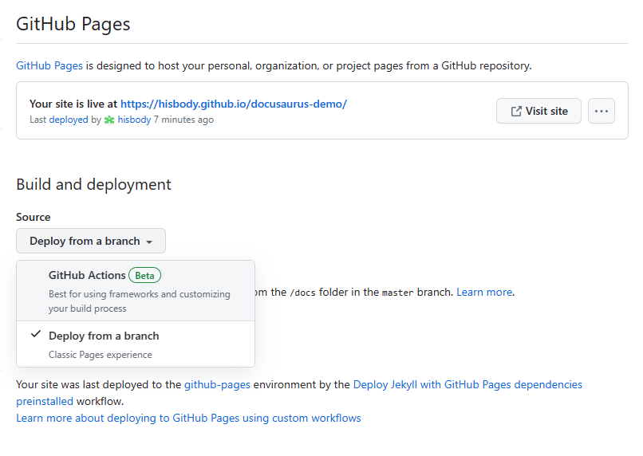

# 部署你的网站

# Deploy your site

Docusaurus是一个**静态站点生成器**(也称为**[Jamstack](https://jamstack.org/)**)。  
Docusaurus is a **static-site-generator** (also called **[Jamstack](https://jamstack.org/)**).

它建立你的网站作为简单的静态HTML, JavaScript和CSS文件**。  
It builds your site as simple **static HTML, JavaScript and CSS files**.

## 建立你的网站
## Build your site

建立您的网站**用于生产环境**:
Build your site **for production**:

```bash
npm run build
```

静态文件在`build`文件夹中生成。  
The static files are generated in the `build` folder.

## 部署您的站点
## Deploy your site

在本地测试您的生产构建:  
Test your production build locally:

```bash
npm run serve
```

`build`文件夹现在位于[http://localhost:3000/](http://localhost:3000/)。
The `build` folder is now served at [http://localhost:3000/](http://localhost:3000/).

现在你可以轻松地将`build`文件夹以**免费**或非常低的成本部署在**几乎任何地方**，(阅读**[部署指南](https://docusaurus.io/docs/deployment)**)。    
You can now deploy the `build` folder **almost anywhere** easily, **for free** or very small cost (read the **[Deployment Guide](https://docusaurus.io/docs/deployment)**).


## 部署到github

1、docusaurus.config.js文件中，改baseUrl为你的github仓库名。

```js
/** @type {import('@docusaurus/types').Config} */
const config = {
  //   baseUrl: '/', // 开发环境
  baseUrl: '/docusaurus-demo/', // 生产环境
}
```

2、将build文件取消忽略，就可以将这个文件夹push到仓库

```
# /build
```

3、提交代码

生成ssh密钥，添加公钥到github
```
ssh-keygen -t ed25519 -C "xxx@xxx.com"
````

提交代码到github仓库

4、选择设置开启pages页

先选择Github Actions。  
选择配置 Jekyll。

修改这个配置项为： source: ./build

提交会生成 .github/workflows/jekyll-gh-pages.yml文件

.github/workflows/jekyll-gh-pages.yml内容：
```yml
# Sample workflow for building and deploying a Jekyll site to GitHub Pages
name: Deploy Jekyll with GitHub Pages dependencies preinstalled

on:
  # Runs on pushes targeting the default branch
  push:
    branches: ["master"]

  # Allows you to run this workflow manually from the Actions tab
  workflow_dispatch:

# Sets permissions of the GITHUB_TOKEN to allow deployment to GitHub Pages
permissions:
  contents: read
  pages: write
  id-token: write

# Allow only one concurrent deployment, skipping runs queued between the run in-progress and latest queued.
# However, do NOT cancel in-progress runs as we want to allow these production deployments to complete.
concurrency:
  group: "pages"
  cancel-in-progress: false

jobs:
  # Build job
  build:
    runs-on: ubuntu-latest
    steps:
      - name: Checkout
        uses: actions/checkout@v3
      - name: Setup Pages
        uses: actions/configure-pages@v3
      - name: Build with Jekyll
        uses: actions/jekyll-build-pages@v1
        with:
          source: ./build
          destination: ./_site
      - name: Upload artifact
        uses: actions/upload-pages-artifact@v1

  # Deployment job
  deploy:
    environment:
      name: github-pages
      url: ${{ steps.deployment.outputs.page_url }}
    runs-on: ubuntu-latest
    needs: build
    steps:
      - name: Deploy to GitHub Pages
        id: deployment
        uses: actions/deploy-pages@v2

```

4、再选择这个：



选择docs文件夹。

保存。

就可以访问页面了。

改内容后.

npm run build

git add .

git push

